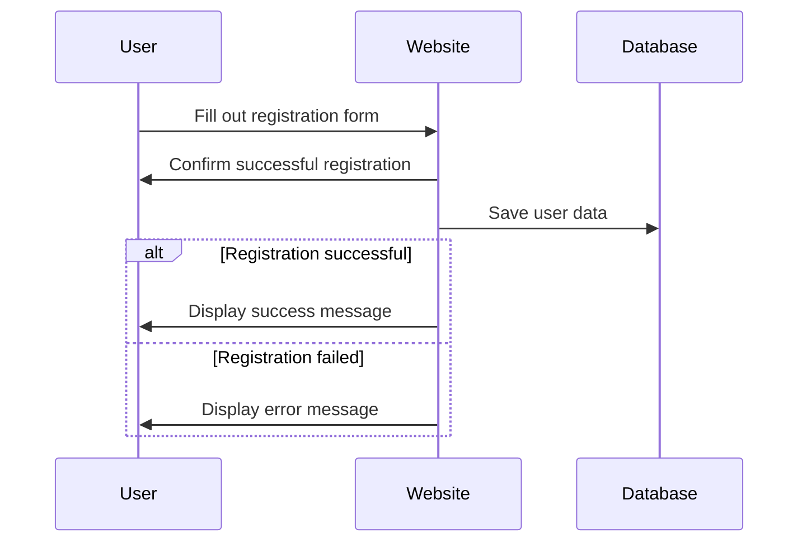
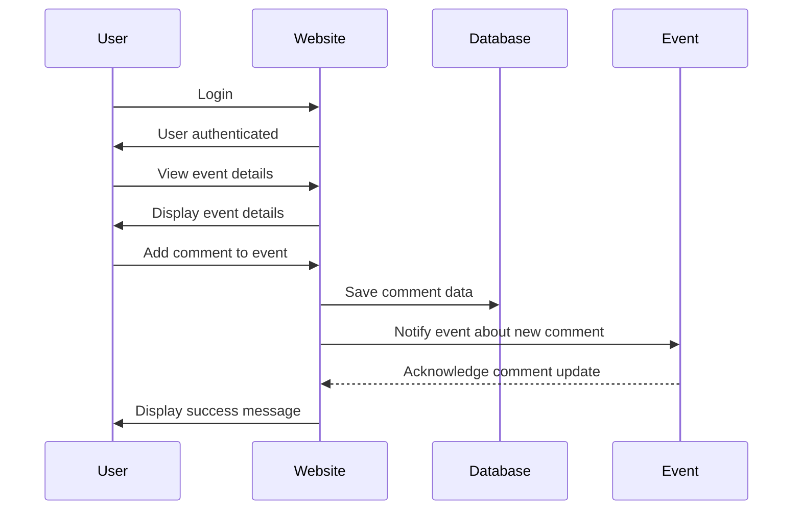

# :bulb: Volunet Project

## Table of Contents
- [:bulb: Project Overview](#project-overview)
- [:page_facing_up: Website Details](#website-details)
  - [:memo: Outline and Objective](#outline-and-objective)
  - [:art: Concept of the Website](#concept-of-the-website)
  - [:dart: Target Audience](#target-audience)
  - [:paintbrush: Creative/Design Specifications](#creativedesign-specifications)
  - [:thought_balloon: Three Words to Describe the Website](#three-words-to-describe-the-website)
  - [:computer: Content and Functionality](#content-and-functionality)
  - [:iphone: Devices](#devices)
  - [:earth_americas: User Experience and Community Impact](#user-experience-and-community-impact)
- [:heavy_check_mark: Implemented Features](#implemented-features)
- [:link: API Endpoints](#api-endpoints)
  - [:mag_right: Get Events](#get-events)
  - [:mag: Get Event by ID](#get-event-by-id)
  - [:heavy_plus_sign: Create Event](#create-event)
  - [:pencil: Update Event](#update-event)
  - [:x: Delete Event](#delete-event)
  - [:speech_balloon: Add Comment to Event](#add-comment-to-event)
  - [:heavy_minus_sign: Delete Comment from Event](#delete-comment-from-event)
  - [:+1: Add Like to Event](#add-like-to-event)
  - [:heavy_multiplication_x: Remove Like from Event](#remove-like-from-event)
  - [:1234: Submit Rating for Event](#submit-rating-for-event)
  - [:busts_in_silhouette: Join User to Event](#join-user-to-event)
  - [:bust_in_silhouette: Remove User from Event](#remove-user-from-event)
  - [:traffic_light: Get Application Status](#get-application-status)
  - [:warning: Submit Report](#submit-report)
- [:closed_lock_with_key: Access Levels](#access-levels)
  - [:bust_in_silhouette: Normal Users](#normal-users)
  - [:briefcase: Organizer Users](#organizer-users)
  - [:crown: Administrators](#administrators)

## :bulb: Project Overview

The Volunet project is a free website that aims to connect individuals with volunteer opportunities to create a positive impact in their communities. The platform serves as a bridge between volunteers and non-profit organizations, enabling users to discover, participate in, and organize various volunteering events tailored to their interests and passions.

## :page_facing_up: Website Details

### :memo: Outline and Objective

The core objectives of the Volunet website are as follows:

1. **Empowering Volunteering:** The website's primary goal is to empower individuals by providing them with easy access to a wide range of volunteer opportunities in their local communities. By connecting volunteers with meaningful causes, the platform encourages a sense of purpose and engagement.

2. **Facilitating Community Impact:** Volunet strives to foster a culture of community impact and social responsibility. By promoting volunteer events that serve the community's needs, the website aims to bring positive change and make a difference.

### :art: Concept of the Website

The concept behind Volunet revolves around inclusivity, collaboration, and social good. The platform fosters a sense of unity among individuals from diverse backgrounds, enabling them to come together, contribute their skills and time, and collectively make a significant impact on various social, environmental, and humanitarian causes.

### :dart: Target Audience

The website is designed for individuals of all ages and backgrounds who are passionate about creating positive change through volunteering. Whether they are students, working professionals, or retirees, the platform welcomes everyone to be part of the community-driven effort to make the world a better place.

### :paintbrush: Creative/Design Specifications

While specific creative/design specifications have not been outlined, the user experience and interface design prioritize simplicity, intuitiveness, and accessibility. The focus is on providing a seamless browsing experience that encourages users to explore and engage with volunteer opportunities effortlessly.

### :thought_balloon: Three Words to Describe the Website

1. **Empowerment**
2. **Community**
3. **Impact**

### :computer: Content and Functionality

The Volunet website offers a diverse range of features and functionalities to enhance the user experience and community impact:

1. **User Account:** Users can easily create accounts, enabling them to access personalized features and participate in volunteer events that align with their interests and values.

2. **Volunteer Opportunities:** The platform provides an extensive database of volunteer events, making it simple for users to find and join events that resonate with their passions.

3. **Community Collaboration:** Users can actively engage with events by writing comments, giving ratings, and expressing appreciation through likes, fostering a sense of collaboration and camaraderie.

4. **Event Reporting System:** To maintain the platform's integrity, Volunet allows users to report events that may not align with the website's mission. When an event receives a significant number of reports, it undergoes review, ensuring only meaningful and genuine events are featured.

5. **Notification System:** The website features a comprehensive notification system to keep users informed about essential updates, such as registration confirmation, application status, and new event listings. Users can choose to receive notifications both within the platform and through email.

6. **Responsibility and Social Impact:** By promoting events organized by non-profit organizations and focusing solely on community-oriented initiatives, the platform upholds its responsibility to maximize social impact and create lasting change.

### :iphone: Devices

The website is thoughtfully designed to deliver a seamless experience across various devices, including desktops, laptops, and mobile web browsers. This multi-device compatibility ensures that users can access and engage with Volunet's features from any location with internet connectivity.

### :earth_americas: User Experience and Community Impact

The user experience is at the forefront of Volunet's design and development process. The platform aims to make the volunteering journey enjoyable, rewarding, and inspiring for users. By facilitating connections between volunteers and non-profits, Volunet enables individuals to witness the tangible impact of their contributions to their communities and society at large.

## :heavy_check_mark: Implemented Features

The Volunet website is built on the foundation of several essential features, enhancing the platform's functionality and user experience:

- User Registration and Authentication
- Event Listings with Filtering and Sorting Options
- Event Details and Information
- User Comments and Ratings on Events
- Event Like Functionality
- User Applications for Events
- Event Reporting System
- Notification System for Users
- User Profiles and Account Management
- Administrative Features for Event Management

## :link: API Endpoints

### :mag_right: Get Events

- Endpoint: `GET /api/v1/events`
- Description: This endpoint returns a list of events filtered by the user and other criteria such as date. The events can also be sorted based on the event date.
- Query Parameters:
  - `user`: Filters the events by the user name.
  - `date`: Filters the events by the date.
the events. Multiple events can be provided by separating them with commas.

### :mag: Get Event by ID

- Endpoint: `GET /api/v1

/events/:id`
- Description: This endpoint retrieves detailed information about a specific event based on its unique ID.

### :heavy_plus_sign: Create Event

- Endpoint: `POST /api/v1/events`
- Description: This endpoint allows organizer users to create new events.

### :pencil: Update Event

- Endpoint: `PUT /api/v1/events/:id`
- Description: This endpoint enables the creator of an event or an administrator to update the event details.

### :x: Delete Event

- Endpoint: `DELETE /api/v1/events/:id`
- Description: This endpoint allows the creator of an event or an administrator to delete an event from the platform.

### :speech_balloon: Add Comment to Event

- Endpoint: `POST /api/v1/events/:id/comments`
- Description: Users can add comments to specific events using this endpoint.

### :heavy_minus_sign: Delete Comment from Event

- Endpoint: `DELETE /api/v1/events/:id/comments/:commentId`
- Description: Users can remove their comments from specific events through this endpoint.

### :+1: Add Like to Event

- Endpoint: `PUT /api/v1/events/:id/likes`
- Description: Users can express their appreciation for an event by adding likes using this endpoint.

### :heavy_multiplication_x: Remove Like from Event

- Endpoint: `DELETE /api/v1/events/:id/likes`
- Description: Users can remove their like from an event using this endpoint.

### :1234: Submit Rating for Event

- Endpoint: `PUT /api/v1/events/:id/rating`
- Description: Users can submit ratings for events using this endpoint.

### :busts_in_silhouette: Join User to Event

- Endpoint: `POST /api/v1/events/:id/users`
- Description: Users can join an event through this endpoint.

### :bust_in_silhouette: Remove User from Event

- Endpoint: `DELETE /api/v1/events/:id/users`
- Description: Users can be removed from an event using this endpoint.

### :traffic_light: Get Application Status

- Endpoint: `GET /api/v1/applications/:id/status`
- Description: This endpoint allows users to check the status of their event application.

### :warning: Submit Report

- Endpoint: `POST /api/v1/reports`
- Description: Users can submit a report about an event using this endpoint.

## :closed_lock_with_key: Access Levels

The Volunet website has three access levels, each with different permissions and functionalities:

### :busts_in_silhouette: Normal Users

Normal users have access to the following features:

- Register a new user
- User login
- Get a list of events by filter
- Get an event by ID

### :briefcase: Organizer Users

Organizer users have access to the following features in addition to the normal user functionalities:

- Return profile of the logged-in user
- Update logged-in user information
- Get all notifications
- Create a new event
- Update an event (by the creator or an administrator)
- Add or remove likes from events
- Add comments to events
- Remove comments from events
- Submit or clear ratings for events
- Join a user to an event
- Remove a user from an event
- Get the status of an application
- Submit a report

### :crown: Administrators

Administrators have access to the following features in addition to the organizer user functionalities:

- Get a list of users by filter
- Return a user by ID
- Update a user by ID
- Delete a user
- Create a new notification
- Delete a notification of a user's document
- Get a list of all applications
- Update application status
- Delete an application
- Get a list of all reports
- Get a report by ID
- Update a report
- Delete a report

## :pencil: Sequence Diagram - User Registration

## :pencil: Sequence Diagram - Add Comment to Event

